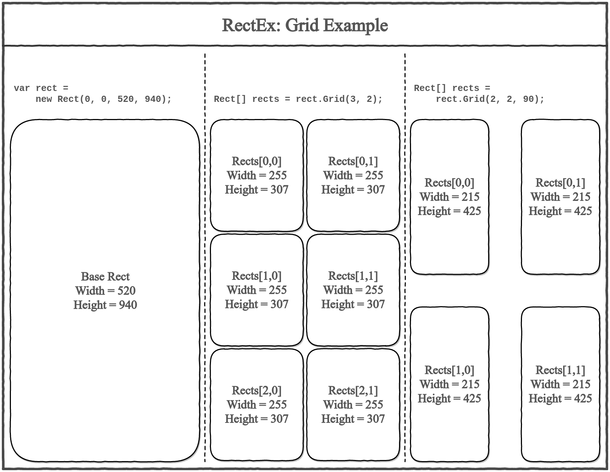
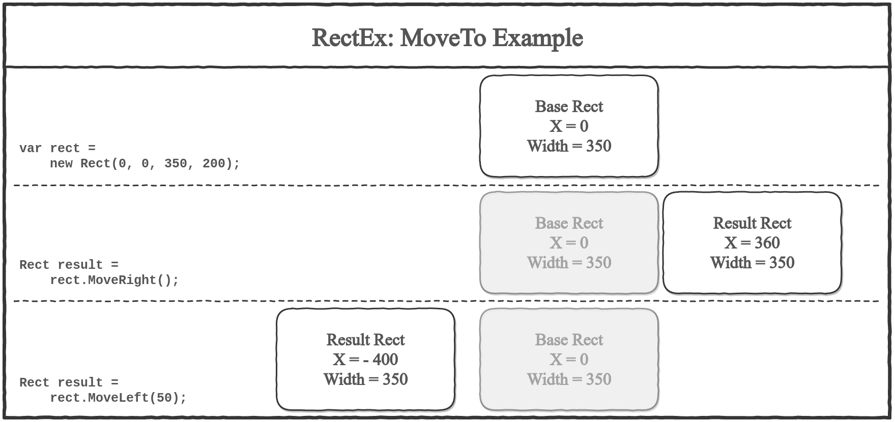
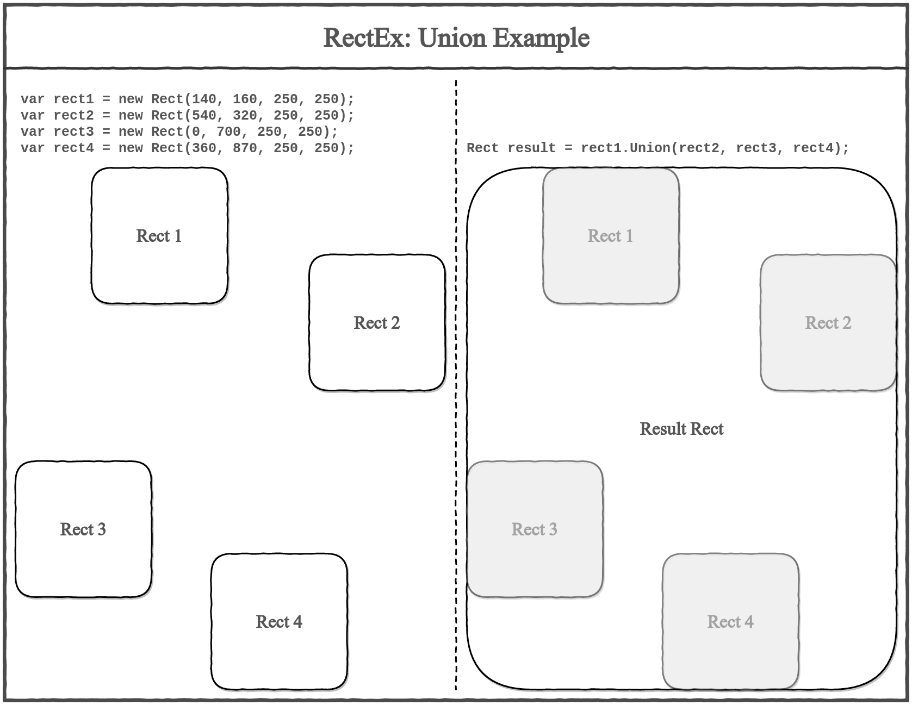
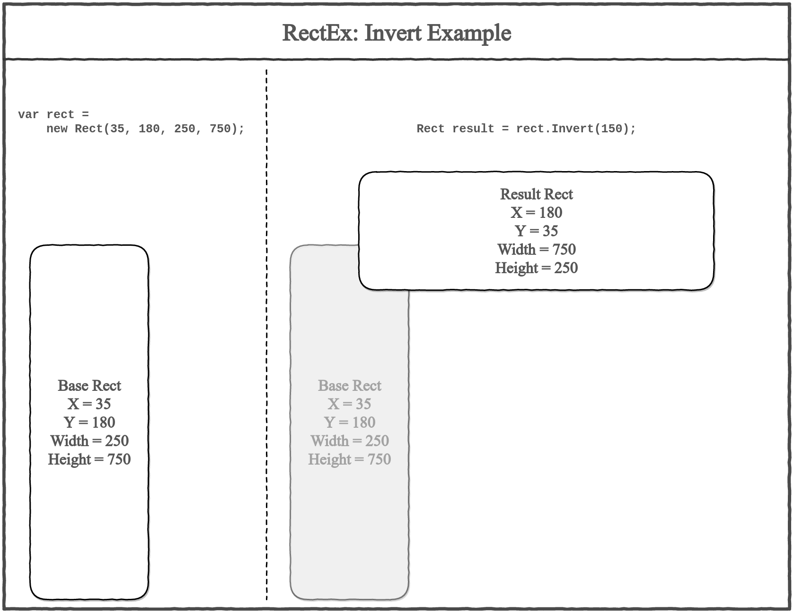

# TL;DR

RectEx is a tool simplifying drawing pure EditorGUI in [Unity3d](https://unity3d.com). 

RectEx consists of a few extensions of `Rect` class which provides an interface to work with rects simpler. 

Stop doing 

```csharp
rect.height = 18;
GUI.LabelField(rect, "First line");
rect.y += rect.height;
GUI.LabelField(rect, "Second line");
rect.y += rect.height;
rect.width = (rect.width - 5) / 2;
GUI.LabelField(rect, "Third line: left part");
rect.x += rect.width + 5;
GUI.LabelField(rect, "Third line: right part");
```

Use **Column** and **Row** instead:

```csharp
using RectEx;
```
```csharp
var rects = rect.Column(3);
GUI.LabelField(rects[0], "First line");
GUI.LabelField(rects[1], "Second line");

rects = rects[2].Row(2);
GUI.LabelField(rects[0], "Third line: left part");
GUI.LabelField(rects[1], "Third line: right part");
```

RectEx is an Unity3d asset. *But you will not find RectEx in the AssetStore, I'm going to publish it soon.*

# Why do you need it?

Because you don't want to get lost between all these `rect.y += rect.height` and `rect.width = (rect.width - 5) / 2`.

Because you want to draw your GUI elements easily and feel yourself comfortable.

Because you want to make your code more readable.

Because you can.

# Contributing

If you want to add a bug report or feature request, just add an issue or PR. 

If you create a Pull Request with new feature or bugfix, please write a test[s].

If you find any errors in this text, feel free to fix it.

# How to use it?

First of all, add *using* statement:

```csharp
using RectEx;
```

There are two base methods:
* `rect.Column(...)` -- makes a column from your rect with horizontal lines.
* `rect.Row(...)` -- makes a row with vertical lines.

There are other methods in RectEx, but Column and Row are the most useful.

Both of them provide two variants of usage:
* pass to method an integer **count** of slices and it will cut rect into equal pieces;  
  For example, use `rect.Raw(5);` and you will get a row of 5 cells;
* pass to method an array of floats and it will cut rect into differet pieces.  
  For example, use `rect.Raw(new float[]{1,5})` and you will get two cells: a small one and a big one.

Look at the tests. Tests are the best docs. But if you don't want to read code, read below.

# What methods does it provide?

* [Row](#row)
* [Column](#column)
* [Grid](#grid)
* [CutFrom](#cutfrom)
* [FirstLine](#firstline)
* [MoveTo](#moveto)
* [MoveToFor](#movetofor)
* [Intend](#intend)
* [Extend](#extend)
* [Union](#union)
* [Invert](#invert)
* [Abs](#abs)

## Row

Makes a row based on your rect.

Slices rect with a vertical separators. Returns an array of pieces.

There are two variants: you may pass to `Row` count of pieces or their relative weights (with additive widthes).

```csharp
Rect[] Row(this Rect rect, int count, float space = DEFAULT_SPACE);
Rect[] Row(this Rect rect, float[] weights, float space = DEFAULT_SPACE);
Rect[] Row(this Rect rect, float[] weights, float[] widthes, float space = DEFAULT_SPACE);
```


## Column

Makes a column based on your rect.

Slices rect with a horizontal separators. Returns an array of pieces.

There are two variants: you may pass to `Column` count of pieces or their relative weights (with additive heights).

```csharp
Rect[] Column(this Rect rect, int count, float space = DEFAULT_SPACE);
Rect[] Column(this Rect rect, float[] weights, float space = DEFAULT_SPACE);
Rect[] Column(this Rect rect, float[] weights, float[] heights, float space = DEFAULT_SPACE);
```


## Grid

Makes a grid based on your rect.

Slices rect with a horizontal and vertical separators. Returns a 2d array of pieces (Rect[,])

There are two ways: you may pass a size of grid or separated counts of rows and columns.

```csharp
Rect[,] Grid(this Rect rect, int size, float space = DEFAULT_SPACE);
Rect[,] Grid(this Rect rect, int rows, int columns, float space = DEFAULT_SPACE);
Rect[,] Grid(this Rect rect, int rows, int columns, float spaceBetweenRows, float spaceBetweenColumns);
```



## CutFrom

Section CutFrom consists of four methods: CutFromRight, CutFromLeft, CutFromTop and CutFromBottom.

CutFrom cuts a piece from one of four directions. Returns an array of two pieces: the cut and the rest.

You can use `Row` and `Column` to get the same but CutFrom is easier, faster and  more readable.

```csharp
Rect[] CutFromRight(this Rect rect, float width, float space = DEFAULT_SPACE);
Rect[] CutFromLeft(this Rect rect, float width, float space = DEFAULT_SPACE);
Rect[] CutFromBottom(this Rect rect, float height, float space = DEFAULT_SPACE);
Rect[] CutFromTop(this Rect rect, float height, float space = DEFAULT_SPACE);
```


## FirstLine

Method FirstLine is a sugar for `rect = rect.CutFromTop(height, 0)[0]`. 

I noticed that I often use that construction so I just add FirstLine method to simplify my code.

Threr is no _space_ because it returns single rect. 

```csharp
Rect FirstLine(this Rect rect, float height = 18);
```

I use FirstLine in this way:

```csharp
rect = rect.FirstLine(18);
// Draw first line
rect = rect.MoveDown();
// Draw second line
rect = rect.MoveDown();
// Draw third line
```

## MoveTo

Section MoveTo like CutFrom consists of four methods: MoveRight, MoveLeft, MoveUp, MoveDown.

MoveTo moves rect per its width/height. As same as using `rect.y += rect.height;`. Returns a rect.

```csharp
Rect MoveRight(this Rect rect, float space = DEFAULT_SPACE);
Rect MoveLeft(this Rect rect, float space = DEFAULT_SPACE);
Rect MoveBottom(this Rect rect, float space = DEFAULT_SPACE);
Rect MoveTop(this Rect rect, float space = DEFAULT_SPACE);
```



## MoveToFor

Section MoveToFor is like MoveTo, but allows you to specify size of step.

MoveToFor moves rect per specified step. As same as using `rect.y += step;`. Returns a rect.

```csharp
Rect MoveRightFor(this Rect rect, float step, float space = DEFAULT_SPACE);
Rect MoveLeftFor(this Rect rect, float step, float space = DEFAULT_SPACE);
Rect MoveBottomFor(this Rect rect, float step, float space = DEFAULT_SPACE);
Rect MoveTopFor(this Rect rect, float step, float space = DEFAULT_SPACE);
```

~~Sorry, there is no image yet~~

## Intend

Intend creates a border inside rect. Returns a new Rect.

```csharp
Rect Intend(this Rect rect, float border);
```


## Extend

Extend creates a border outside the rect. Returns a new rect.

```csharp
Rect Extend(this Rect rect, float border);
```


## Union

Union creates a new rect, contains all rects you pass. Returns a new rect.

```csharp
Rect Union(this Rect rect, params Rect[] other);
```



## Invert

Invert swaps x with y; width with height. Returns a new rect.

```csharp
Rect Invert(this Rect rect);
```



## Abs

Abs returns the same rect with positive width and height.

```csharp
Rect Abs(this Rect rect);
```


*I niticed __Union()__ at the top of image. Don't panic! It is just a bug. This is an example of __Abs__ function. Sorry. I will repair it someday.*
